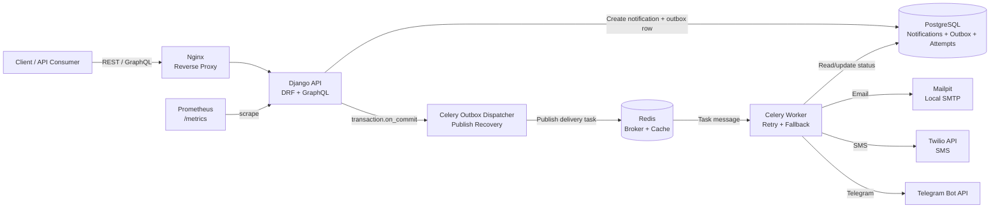
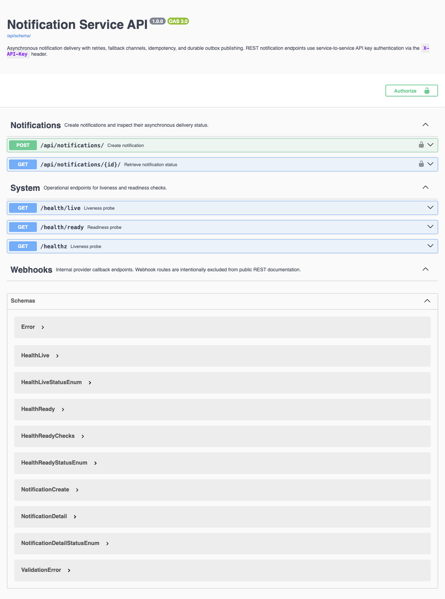
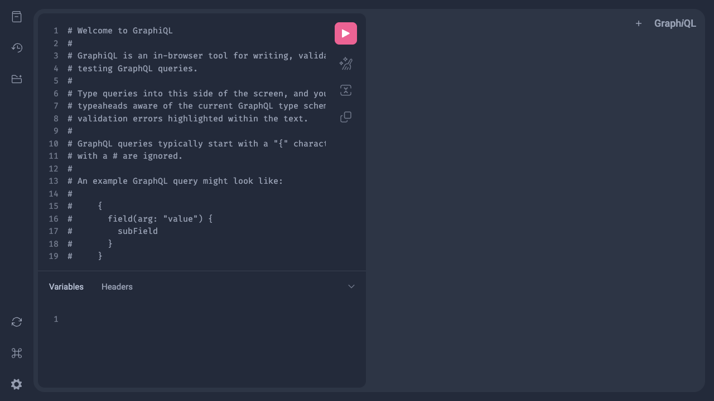
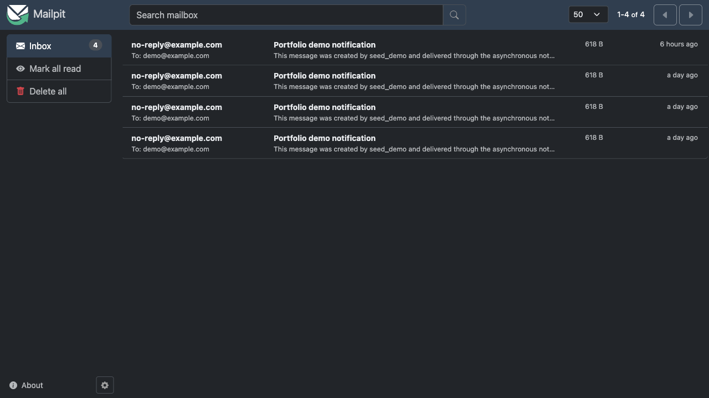
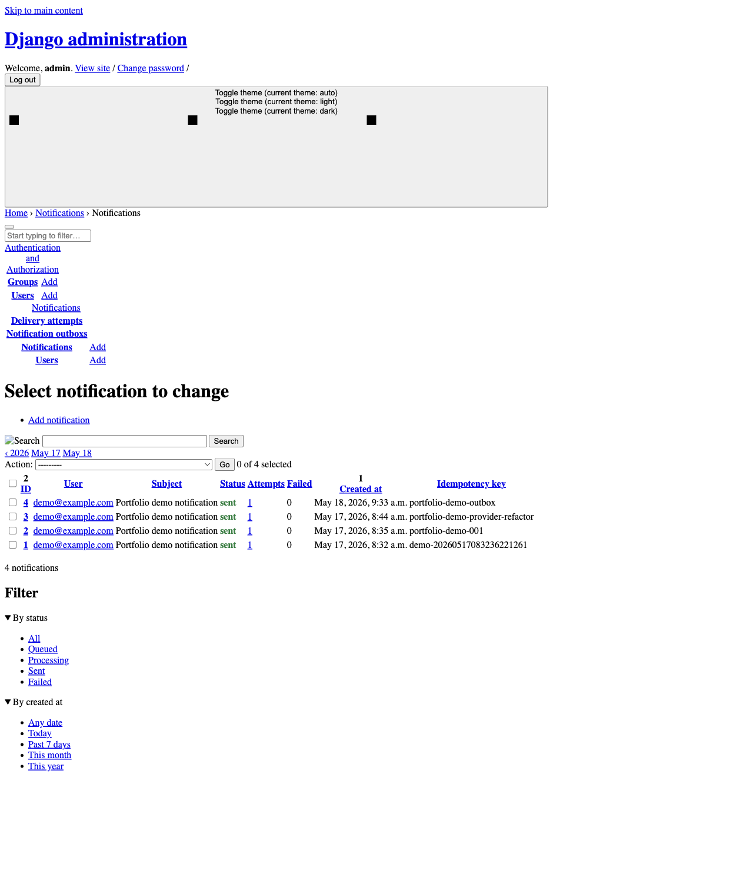
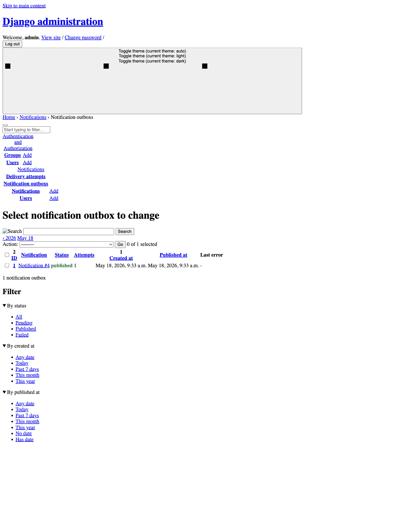
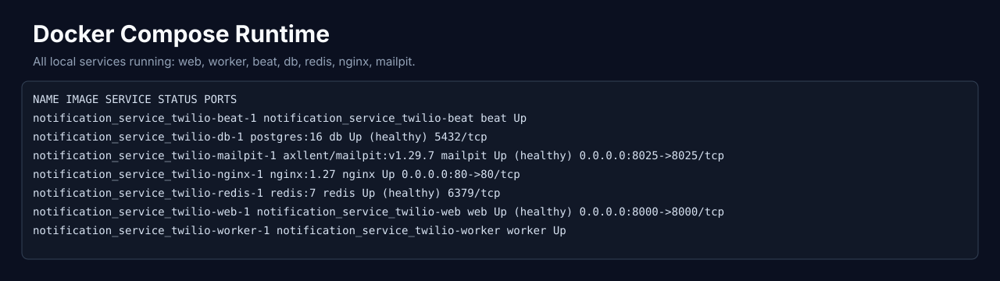
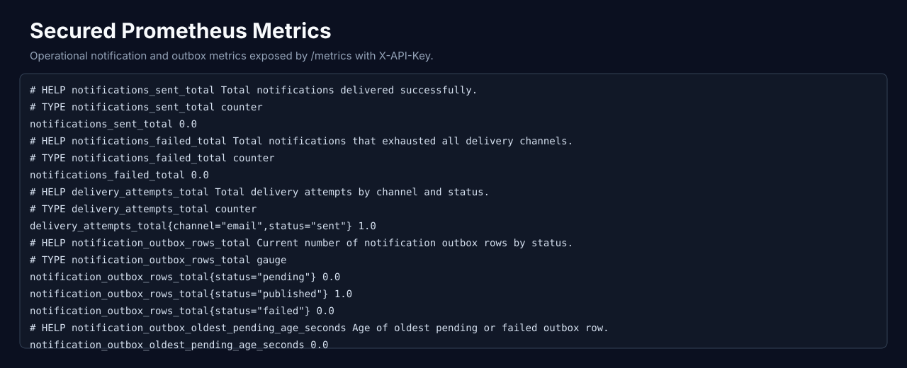

# Notification Service


A production-oriented notification service built with **Django**, **Django REST Framework**,
**Celery**, **Redis**, **PostgreSQL**, **Strawberry GraphQL**, and **Docker**.

The service accepts notification requests, stores them durably, and delivers them
asynchronously through prioritized channels:

```text
Email -> SMS -> Telegram
```

It is designed to demonstrate reliability patterns that matter in real backend systems:
background processing, retry/backoff, fallback delivery, idempotent enqueueing, and an
auditable delivery history.

## Documentation

- [Technical Documentation](docs/TECHNICAL_DOCUMENTATION.md) - complete engineering
  handbook with architecture, flows, configuration, observability, Docker runtime,
  troubleshooting, and a file-by-file project reference.
- [Demo Script](docs/DEMO_SCRIPT.md) - step-by-step portfolio walkthrough for Swagger,
  Mailpit, admin, health checks, secured metrics, idempotency, and outbox recovery.
- [API Examples](docs/API_EXAMPLES.md) - copy-paste REST, GraphQL, webhook, health,
  metrics, and outbox recovery examples.
- [Production Checklist](docs/PRODUCTION_CHECKLIST.md) - deployment, security,
  observability, backup, rollback, and smoke-test checklist.

## Features

- REST API for creating and retrieving notifications.
- API key authentication for service-to-service REST access.
- Scoped throttling for notification endpoints.
- OpenAPI schema and Swagger UI for REST API exploration.
- GraphQL mutation/query support through Strawberry.
- Telegram webhook onboarding for automatic `chat_id` capture.
- Celery worker for asynchronous delivery.
- Redis as Celery broker/result backend and Django cache backend.
- PostgreSQL persistence for users, notifications, and delivery attempts.
- Channel fallback based on user-level priority.
- Per-channel retry tracking with delivery audit records.
- Idempotency key support to prevent duplicate notification enqueueing.
- Request correlation with `X-Request-ID`.
- Structured JSON logs for API and delivery workflows.
- Prometheus counters for notification and delivery attempt outcomes.
- Docker Compose setup for local development.
- GitHub Actions CI for Ruff, migration checks, coverage gate, security audit, and Docker smoke.
- Mailpit integration for local email testing.

## Tech Stack

- **Python 3.12**
- **Django 4.2**
- **Django REST Framework**
- **Strawberry GraphQL**
- **Celery**
- **Redis**
- **PostgreSQL**
- **Nginx**
- **Docker / Docker Compose**
- **Ruff**
- **Coverage.py**
- **pip-audit**
- **Prometheus client**

## Architecture

High-level request and delivery flow:

```text
Client / Internal Service
        |
        v
      Nginx
        |
        v
Django REST / GraphQL API
        |
        |  persist Notification + NotificationOutbox
        v
   PostgreSQL
        |
        |  transaction.on_commit(...) schedules dispatcher
        v
   Celery outbox dispatcher
        |
        |  publish delivery task
        v
   Redis queue/cache
        |
        v
   Celery worker
        |
        |  retry + channel fallback
        v
Email / SMS / Telegram providers
```



Outbox rows are persisted in `NotificationOutbox`, which protects task publishing from
broker failures after a successful database commit. Delivery attempts are persisted in
`DeliveryAttempt`, which makes retries and failures visible for debugging, admin review,
and future analytics.

Core components:

- **Nginx** terminates external HTTP traffic and proxies requests to Django.
- **Django REST / GraphQL API** validates requests, enforces API key auth, throttles
  notification creation, and stores durable notification records.
- **PostgreSQL** stores users, notifications, outbox rows, idempotency keys, and delivery
  attempts.
- **Redis** acts as Celery broker/result backend and cache backend.
- **Celery outbox dispatcher** publishes durable outbox rows to the broker and leaves
  failed publishes recoverable.
- **Celery worker** performs provider calls outside the request path, with retry and
  fallback behavior.
- **Providers** deliver messages through SMTP/Mailpit, Twilio SMS, and Telegram Bot API.

## Visual Proof

The project includes several inspectable surfaces that make the backend behavior easy to
verify during a portfolio review.

### Swagger UI

Interactive REST API documentation is available at:

```text
http://localhost:8000/api/docs/
```

OpenAPI schema:

```text
http://localhost:8000/api/schema/
```

The Swagger UI shows notification endpoints, API key auth, request examples, response
schemas, idempotency behavior, and common error responses such as `400`, `401`, `404`,
and `429`.



### GraphQL Playground

GraphiQL is available at:

```text
http://localhost:8000/graphql
```

It can be used to run the `createNotification` mutation and inspect notification status
queries without an external GraphQL client.



### Mailpit

Mailpit captures local SMTP traffic and proves that the email delivery path works without
sending real messages:

```text
http://localhost:8025
```

After creating a notification for a user with an email address, the delivered email should
appear in the Mailpit inbox.



### Django Admin

The admin UI works as a small operational dashboard:

```text
http://localhost:8000/admin/
```

Useful portfolio screenshots:

- Notification list with colored status, attempt counts, failed attempt counts, and idempotency key.
- Notification detail page with inline delivery attempts.
- Delivery attempt list filtered by channel, success, and creation time, with linked users.
- User list with notification counts, latest notification time, and channel priority.
- Admin action that clones selected failed notifications for redelivery while preserving audit history.





### Docker Containers

The full stack runs through Docker Compose:

```bash
docker compose ps
```

Expected services:

```text
web       Django + Gunicorn application
worker    Celery worker
beat      Celery beat
db        PostgreSQL
redis     Redis broker/cache
nginx     Reverse proxy
mailpit   Local SMTP inbox
```

PostgreSQL and Redis use named Docker volumes (`postgres_data`, `redis_data`) so local
state survives container recreation. Use `docker compose down --volumes` only when you
intentionally want a clean database and cache.



### Metrics

Prometheus metrics are exposed through a secured endpoint:

```bash
curl http://localhost:8000/metrics \
  -H "X-API-Key: dev-notification-api-key"
```

The metrics surface includes notification counters, delivery attempt counters, and durable
outbox gauges for recovery monitoring.



### API Endpoints

| Method | Endpoint | Description |
| --- | --- | --- |
| `POST` | `/api/notifications/` | Create and enqueue a notification; requires `X-API-Key` |
| `GET` | `/api/notifications/{id}/` | Retrieve notification status; requires `X-API-Key` |
| `POST` | `/webhooks/telegram/` | Telegram Bot API webhook for `/start` onboarding |
| `GET` | `/api/schema/` | OpenAPI schema |
| `GET` | `/api/docs/` | Swagger UI |
| `GET` | `/metrics` | Prometheus metrics |
| `GET` | `/graphql` | GraphiQL playground |
| `GET` | `/health/live` | Liveness check |
| `GET` | `/health/ready` | Readiness check for DB/cache |
| `GET` | `/healthz` | Backward-compatible liveness alias |
| `GET` | `/admin/` | Django admin |

## Delivery Flow

1. A client creates a notification through REST or GraphQL.
2. Django stores the `Notification` in PostgreSQL.
3. After the transaction commits, the notification is enqueued to Celery.
4. The worker marks the notification as `processing`.
5. The worker tries each channel in `User.channel_priority`.
6. Each failed channel is retried up to the configured limit.
7. If a channel succeeds, the notification is marked `sent`.
8. If all channels fail, the notification is marked `failed`.

Supported statuses:

```text
queued -> processing -> sent
queued -> processing -> failed
```

## Project Structure

```text
notifications/
  models.py                 # User, Notification, NotificationOutbox, DeliveryAttempt
  serializers.py            # DRF serializers
  views.py                  # REST viewset and health endpoint
  schema.py                 # GraphQL schema
  tasks.py                  # Celery outbox dispatcher and delivery task
  management/
    commands/
      seed_demo.py          # One-command portfolio demo flow
      dispatch_outbox.py    # Manual outbox recovery command
  services/
    producer.py             # Idempotent enqueueing
    factory.py              # Provider factory
    providers/
      base.py               # ProviderResult, ProviderError, provider protocol
      email.py              # SMTP provider
      sms_twilio.py         # Twilio SMS provider
      telegram.py           # Telegram Bot API provider

notifier/
  settings/
    base.py                 # Shared Django, Celery, Redis, database settings
    local.py                # Local Docker/development settings
    test.py                 # Fast deterministic test settings
    production.py           # Security-hardened production settings
  celery.py                 # Celery app configuration
  urls.py                   # REST, GraphQL, admin, health routes

deploy/
  nginx.conf                # Nginx reverse proxy config
```

## Quick Start

Copy the example environment file:

```bash
cp .env.example .env
```

Start the stack:

```bash
make rebuild
```

Run migrations:

```bash
make migrate
```

Create demo data and enqueue a notification through the real delivery pipeline:

```bash
make demo
```

Mailpit is available at:

```text
http://localhost:8025
```

The command prints the created user ID, notification ID, idempotency key, and the main
inspection URLs. Pass a fixed key to demonstrate deduplication:

```bash
make demo-idempotent
```

## REST API Example

Create a notification:

```bash
curl -X POST http://localhost:8000/api/notifications/ \
  -H "Content-Type: application/json" \
  -H "X-API-Key: dev-notification-api-key" \
  -H "X-Request-ID: portfolio-demo-001" \
  -d '{
    "user_id": 1,
    "subject": "Hello",
    "message": "Test from DRF",
    "idempotency_key": "demo-001"
  }'
```

Retrieve notification status:

```bash
curl http://localhost:8000/api/notifications/1/ \
  -H "X-API-Key: dev-notification-api-key" \
  -H "X-Request-ID: portfolio-demo-001"
```

## GraphQL Example

Open GraphiQL:

```text
http://localhost:8000/graphql
```

Run a mutation:

```graphql
mutation {
  createNotification(
    userId: 1
    subject: "Hello"
    message: "Test from GraphQL"
    idempotencyKey: "graphql-demo-001"
  ) {
    id
    status
  }
}
```

Query a notification:

```graphql
query {
  notification(id: 1) {
    id
    status
    subject
    message
  }
}
```

## Development

The default development profile is `notifier.settings.local`. Docker Compose sets it for
the web, worker, and beat containers.

Run tests with the Docker test override. This avoids binding PostgreSQL, Redis, and
Mailpit ports to the host, which makes the command safer on machines where those ports
are already in use.

```bash
docker compose -p notification_service_twilio_test -f docker-compose.yml -f docker-compose.test.yml run --rm web python manage.py test notifications
```

Run linting:

```bash
python -m ruff check .
python -m ruff format --check .
```

Run the same quality gates used by CI:

```bash
DJANGO_SETTINGS_MODULE=notifier.settings.test python -m coverage run manage.py test notifications
DJANGO_SETTINGS_MODULE=notifier.settings.test python -m coverage report
DJANGO_SETTINGS_MODULE=notifier.settings.test python manage.py makemigrations --check --dry-run
python -m pip_audit -r requirements.txt --strict
```

Run migrations:

```bash
docker compose exec web python manage.py makemigrations
docker compose exec web python manage.py migrate
```

Create an admin user:

```bash
docker compose exec web python manage.py createsuperuser
```

Open the operational dashboard:

```text
http://localhost:8000/admin/
```

Follow Celery worker logs:

```bash
docker compose logs -f worker
```

Check service health:

```bash
curl http://localhost:8000/health/live
curl http://localhost:8000/health/ready
```

## CI/CD

GitHub Actions runs three independent gates:

- `quality`: Ruff lint/format, Django system check, migration check, and tests with the
  configured coverage threshold.
- `security`: `pip-audit` against pinned runtime dependencies, with a JSON audit artifact.
- `docker`: runtime image build plus Docker Compose smoke test against `/health/live` and
  `/health/ready`.

## Settings Profiles

| Module | Purpose |
| --- | --- |
| `notifier.settings.local` | Local Docker development with debug enabled by default |
| `notifier.settings.test` | Test runs with eager Celery, local memory cache, and SQLite |
| `notifier.settings.production` | Production runtime with strict host and HTTPS settings |

Production requires:

```text
DJANGO_SETTINGS_MODULE=notifier.settings.production
DJANGO_SECRET_KEY=strong-secret
DJANGO_ALLOWED_HOSTS=example.com,www.example.com
DJANGO_CSRF_TRUSTED_ORIGINS=https://example.com,https://www.example.com
NOTIFICATION_API_KEY=strong-service-api-key
METRICS_API_KEY=strong-metrics-api-key
ENABLE_GRAPHIQL=0
LOG_LEVEL=INFO
```

## Observability

Every HTTP response includes an `X-Request-ID` header. If the caller provides
`X-Request-ID`, the service reuses it; otherwise, it generates a new request id.

The application writes structured JSON logs to stdout. Delivery logs include operational
fields such as `notification_id`, `channel`, `attempt`, `status`, `error`, and
`countdown_seconds`.

Example log events:

```json
{"level":"INFO","logger":"notifications.services.producer","message":"notification.created","request_id":"portfolio-demo-001","notification_id":1,"user_id":1,"idempotency_key":"demo-001"}
{"level":"INFO","logger":"notifications.tasks","message":"notification.channel_attempt","notification_id":1,"channel":"email","attempt":1}
{"level":"WARNING","logger":"notifications.tasks","message":"notification.channel_failed","notification_id":1,"channel":"email","attempt":1,"error":"smtp unavailable"}
{"level":"INFO","logger":"notifications.tasks","message":"notification.retry_scheduled","notification_id":1,"channel":"email","attempt":2,"countdown_seconds":5}
{"level":"INFO","logger":"notifications.tasks","message":"notification.sent","notification_id":1,"channel":"sms","status":"sent"}
```

Prometheus metrics are exposed at:

```bash
curl http://localhost:8000/metrics \
  -H "X-API-Key: dev-notification-api-key"
```

Key metrics:

```text
notifications_sent_total
notifications_failed_total
delivery_attempts_total{channel,status}
notification_outbox_rows_total{status}
notification_outbox_publish_attempts_total{status}
notification_outbox_oldest_pending_age_seconds
```

## Architecture Decisions

- **Celery for delivery**: notification delivery is slow and failure-prone because it
  depends on external providers, so it runs outside the request/response path.
- **`transaction.on_commit` before enqueueing**: Celery tasks are published only after the
  `NotificationOutbox` row is committed, preventing workers from loading missing data.
- **Durable outbox**: notification creation and task-publish intent are stored in the same
  database transaction. If broker publishing fails, the outbox row remains recoverable via
  the periodic Celery beat dispatcher or `python manage.py dispatch_outbox`.
- **Idempotency key**: clients can safely retry `POST /api/notifications/` without
  creating duplicate notifications or duplicate delivery jobs.
- **Delivery attempts audit trail**: each provider attempt is persisted for debugging,
  support workflows, admin review, and future analytics.
- **API key auth**: the REST API is designed for service-to-service calls, where a shared
  service key is simpler and more realistic than end-user login flows.

## Provider Notes

Providers share a small contract: successful sends return `ProviderResult`, and delivery
failures raise `ProviderError` with an explicit `retryable` flag. Retryable failures are
retried with Celery backoff; non-retryable failures are audited once and the worker moves
to the next fallback channel.

**Email**

Email is sent through SMTP. In local Docker development, Mailpit captures messages so
email delivery can be tested without sending real email.

**SMS**

SMS delivery uses the Twilio API. Provide real Twilio credentials in `.env` before
testing live SMS delivery.

**Telegram**

Telegram delivery calls the Telegram Bot API. A real `TELEGRAM_BOT_TOKEN` and a valid
`telegram_chat_id` are required for live delivery. The project also includes a Telegram
webhook that handles `/start` and stores the caller's `chat_id` automatically.

## Telegram Bot Onboarding

Create a bot through BotFather, then set:

```text
TELEGRAM_BOT_TOKEN=123456:real-token
TELEGRAM_WEBHOOK_SECRET=strong-random-secret
```

Expose the local app with a public HTTPS tunnel such as ngrok or Cloudflare Tunnel, then
register the webhook:

```bash
curl -X POST "https://api.telegram.org/bot$TELEGRAM_BOT_TOKEN/setWebhook" \
  -d "url=https://your-public-url.example.com/webhooks/telegram/" \
  -d "secret_token=$TELEGRAM_WEBHOOK_SECRET"
```

Demo flow:

1. Open the bot in Telegram.
2. Send `/start`.
3. The webhook creates or reuses a `User` with `telegram_chat_id`.
4. Create a notification for that user.
5. If earlier channels fail or Telegram is first in `channel_priority`, the message is
   delivered through the bot.

## Twilio Configuration

Set the following variables in `.env`:

```text
TWILIO_SID=ACxxxxxxxxxxxxxxxxxxxxxxxxxxxxxxx
TWILIO_TOKEN=your_auth_token
TWILIO_FROM=+1XXXXXXXXXX
```

For Twilio trial accounts, both the sender and recipient may need to be verified.

## Reliability Notes

- Tasks are enqueued only after the database transaction commits.
- `NotificationOutbox` stores durable publish intent before any Celery task is sent.
- Celery beat runs periodic outbox recovery and republishes pending or failed outbox rows.
- If automatic recovery needs to be forced, run `python manage.py dispatch_outbox`.
- The dispatcher locks each outbox row before publishing, so overlapping immediate and
  periodic dispatchers do not publish the same row concurrently.
- `notification_outbox_oldest_pending_age_seconds` should normally be `0`; a growing
  value means outbox rows are waiting for dispatch or broker recovery.
- Reusing an `idempotency_key` returns the existing notification instead of creating
  and enqueueing a duplicate.
- Every provider attempt is stored in `DeliveryAttempt`.
- Failed channels do not silently disappear; they are retained with error messages.
- The notification status reflects the final delivery outcome.
- Each channel is attempted up to the configured retry limit before fallback continues to
  the next channel in `User.channel_priority`.
- If all channels fail, the notification is marked `failed` and can be cloned for
  redelivery from Django admin without deleting the original audit history.

## Operating Notes

- Use `/health/live` for process liveness checks.
- Use `/health/ready` for readiness checks that depend on database and cache access.
- Scrape `/metrics` with `X-API-Key`; use a dedicated `METRICS_API_KEY` in production.
- Keep GraphiQL disabled in production with `ENABLE_GRAPHIQL=0`.
- Rotate `NOTIFICATION_API_KEY`, `METRICS_API_KEY`, provider credentials, and Telegram
  webhook secrets through environment variables or your secret manager.
- Use structured JSON logs and `X-Request-ID` to correlate API requests with delivery
  attempts in worker logs.

## Current Limitations

- Provider credentials are configured through environment variables only.
- Observability can be expanded with tracing and Sentry.

## Roadmap

- Add Sentry/OpenTelemetry tracing for API requests and Celery tasks.
- Add deployment manifests for a production platform.
