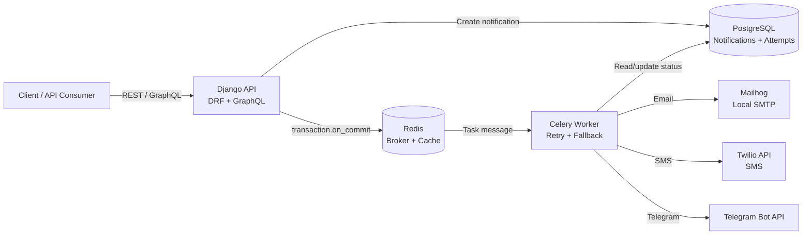

# Notification Service

A production-oriented notification service built with **Django**, **Django REST Framework**,
**Celery**, **Redis**, **PostgreSQL**, **Strawberry GraphQL**, and **Docker**.

The service accepts notification requests, stores them durably, and delivers them
asynchronously through prioritized channels:

```text
Email -> SMS -> Telegram
```

It is designed to demonstrate reliability patterns that matter in real backend systems:
background processing, retry/backoff, fallback delivery, idempotent enqueueing, and an
auditable delivery history.

## Features

- REST API for creating and retrieving notifications.
- OpenAPI schema and Swagger UI for REST API exploration.
- GraphQL mutation/query support through Strawberry.
- Celery worker for asynchronous delivery.
- Redis as Celery broker/result backend and Django cache backend.
- PostgreSQL persistence for users, notifications, and delivery attempts.
- Channel fallback based on user-level priority.
- Per-channel retry tracking with delivery audit records.
- Idempotency key support to prevent duplicate notification enqueueing.
- Docker Compose setup for local development.
- GitHub Actions CI for linting, migration checks, and tests.
- Mailhog integration for local email testing.

## Tech Stack

- **Python 3.12**
- **Django 4.2**
- **Django REST Framework**
- **Strawberry GraphQL**
- **Celery**
- **Redis**
- **PostgreSQL**
- **Nginx**
- **Docker / Docker Compose**
- **Ruff**
- **Coverage.py**

## Architecture



Delivery attempts are persisted in `DeliveryAttempt`, which makes retries and failures
visible for debugging, admin review, and future analytics.

## Visual Proof

The project includes several inspectable surfaces that make the backend behavior easy to
verify during a portfolio review.

### Swagger UI

Interactive REST API documentation is available at:

```text
http://localhost:8000/api/docs/
```

OpenAPI schema:

```text
http://localhost:8000/api/schema/
```

The Swagger UI shows the notification endpoints, request payloads, response schemas, and
status codes.

### GraphQL Playground

GraphiQL is available at:

```text
http://localhost:8000/graphql
```

It can be used to run the `createNotification` mutation and inspect notification status
queries without an external GraphQL client.

### Mailhog

Mailhog captures local SMTP traffic and proves that the email delivery path works without
sending real messages:

```text
http://localhost:8025
```

After creating a notification for a user with an email address, the delivered email should
appear in the Mailhog inbox.

### Docker Containers

The full stack runs through Docker Compose:

```bash
docker compose ps
```

Expected services:

```text
web       Django + Gunicorn application
worker    Celery worker
beat      Celery beat
db        PostgreSQL
redis     Redis broker/cache
nginx     Reverse proxy
mailhog   Local SMTP inbox
```

### API Endpoints

| Method | Endpoint | Description |
| --- | --- | --- |
| `POST` | `/api/notifications/` | Create and enqueue a notification |
| `GET` | `/api/notifications/{id}/` | Retrieve notification status |
| `GET` | `/api/schema/` | OpenAPI schema |
| `GET` | `/api/docs/` | Swagger UI |
| `GET` | `/graphql` | GraphiQL playground |
| `GET` | `/healthz` | Health check |
| `GET` | `/admin/` | Django admin |

## Delivery Flow

1. A client creates a notification through REST or GraphQL.
2. Django stores the `Notification` in PostgreSQL.
3. After the transaction commits, the notification is enqueued to Celery.
4. The worker marks the notification as `processing`.
5. The worker tries each channel in `User.channel_priority`.
6. Each failed channel is retried up to the configured limit.
7. If a channel succeeds, the notification is marked `sent`.
8. If all channels fail, the notification is marked `failed`.

Supported statuses:

```text
queued -> processing -> sent
queued -> processing -> failed
```

## Project Structure

```text
notifications/
  models.py                 # User, Notification, DeliveryAttempt
  serializers.py            # DRF serializers
  views.py                  # REST viewset and health endpoint
  schema.py                 # GraphQL schema
  tasks.py                  # Celery delivery task
  services/
    producer.py             # Idempotent enqueueing
    factory.py              # Provider factory
    providers.py            # Email, SMS, Telegram providers

notifier/
  settings.py               # Django, Celery, Redis, database settings
  celery.py                 # Celery app configuration
  urls.py                   # REST, GraphQL, admin, health routes

deploy/
  nginx.conf                # Nginx reverse proxy config
```

## Quick Start

Copy the example environment file:

```bash
cp .env.example .env
```

Start the stack:

```bash
docker compose up --build
```

Run migrations:

```bash
docker compose exec web python manage.py migrate
```

Create a test user:

```bash
docker compose exec web python manage.py shell -c "from notifications.models import User; User.objects.create(email='me@example.com', phone='+420123456789', telegram_chat_id='12345')"
```

Mailhog is available at:

```text
http://localhost:8025
```

## REST API Example

Create a notification:

```bash
curl -X POST http://localhost:8000/api/notifications/ \
  -H "Content-Type: application/json" \
  -d '{
    "user_id": 1,
    "subject": "Hello",
    "message": "Test from DRF",
    "idempotency_key": "demo-001"
  }'
```

Retrieve notification status:

```bash
curl http://localhost:8000/api/notifications/1/
```

## GraphQL Example

Open GraphiQL:

```text
http://localhost:8000/graphql
```

Run a mutation:

```graphql
mutation {
  createNotification(
    userId: 1
    subject: "Hello"
    message: "Test from GraphQL"
    idempotencyKey: "graphql-demo-001"
  ) {
    id
    status
  }
}
```

Query a notification:

```graphql
query {
  notification(id: 1) {
    id
    status
    subject
    message
  }
}
```

## Development

Run tests with the Docker test override. This avoids binding PostgreSQL, Redis, and
Mailhog ports to the host, which makes the command safer on machines where those ports
are already in use.

```bash
docker compose -p notification_service_twilio_test -f docker-compose.yml -f docker-compose.test.yml run --rm web python manage.py test notifications
```

Run linting:

```bash
ruff check .
```

Run migrations:

```bash
docker compose exec web python manage.py makemigrations
docker compose exec web python manage.py migrate
```

Create an admin user:

```bash
docker compose exec web python manage.py createsuperuser
```

Follow Celery worker logs:

```bash
docker compose logs -f worker
```

Check service health:

```bash
curl http://localhost:8000/healthz
```

## Provider Notes

**Email**

Email is sent through SMTP. In local Docker development, Mailhog captures messages so
email delivery can be tested without sending real email.

**SMS**

SMS delivery uses the Twilio API. Provide real Twilio credentials in `.env` before
testing live SMS delivery.

**Telegram**

Telegram delivery calls the Telegram Bot API. A real `TELEGRAM_BOT_TOKEN` and a valid
`telegram_chat_id` are required for live delivery.

## Twilio Configuration

Set the following variables in `.env`:

```text
TWILIO_SID=ACxxxxxxxxxxxxxxxxxxxxxxxxxxxxxxx
TWILIO_TOKEN=your_auth_token
TWILIO_FROM=+1XXXXXXXXXX
```

For Twilio trial accounts, both the sender and recipient may need to be verified.

## Reliability Notes

- Tasks are enqueued only after the database transaction commits.
- Reusing an `idempotency_key` returns the existing notification instead of creating
  and enqueueing a duplicate.
- Every provider attempt is stored in `DeliveryAttempt`.
- Failed channels do not silently disappear; they are retained with error messages.
- The notification status reflects the final delivery outcome.

## Current Limitations

- Authentication and authorization are not implemented yet.
- API throttling is not enabled yet.
- Provider credentials are configured through environment variables only.
- Observability can be expanded with structured logs, metrics, tracing, and Sentry.
- Settings are currently in a single module and can be split into local/test/production
  modules as the next production-hardening step.

## Roadmap

- Split Django settings into `base`, `local`, `test`, and `production`.
- Add API authentication and request throttling.
- Add structured JSON logging and request correlation IDs.
- Add Prometheus metrics for sent, failed, and retried notifications.
- Add provider-level integration tests with mocked external APIs.
