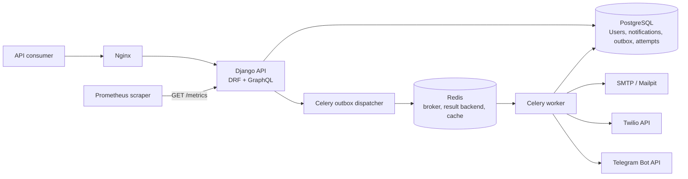

# Technical Documentation

This document is the engineering handbook for the Notification Service. It explains the
system purpose, runtime architecture, file layout, request flows, operational commands,
configuration, observability, and the role of each source file.

The public-facing project overview lives in [`README.md`](../README.md). This document is
intended for maintainers, reviewers, interviewers, and engineers who need to understand
how the service works internally.

## Product Purpose

Notification Service is a backend service for reliable asynchronous notification delivery.
It accepts notification requests through REST or GraphQL, persists them in PostgreSQL, and
delivers them through prioritized channels such as email, SMS, and Telegram.

The service is useful for systems where business workflows must notify users without
blocking the primary application request:

- SaaS products sending account, billing, or workflow updates.
- Marketplaces sending order, booking, or status notifications.
- CRMs and internal tools sending operational alerts.
- Fintech or logistics platforms sending time-sensitive events.
- Any backend that wants one notification pipeline instead of custom delivery logic in
  every product module.

The project demonstrates production-oriented backend patterns:

- Durable notification persistence.
- Outbox pattern for broker publish reliability.
- Celery background delivery.
- Channel fallback.
- Retry/backoff behavior.
- Idempotency keys.
- API key authentication.
- Health checks.
- Prometheus metrics.
- Structured JSON logs.
- Dockerized local runtime.
- CI checks for linting, migrations, tests, dependency audit, and Docker build.

## High-Level Architecture

```text
Client / Internal Service
        |
        v
      Nginx
        |
        v
Django REST / GraphQL API
        |
        |  create Notification + NotificationOutbox
        v
   PostgreSQL
        |
        |  transaction.on_commit schedules outbox dispatcher
        v
Celery Outbox Dispatcher
        |
        |  publish delivery task
        v
      Redis
        |
        v
   Celery Worker
        |
        |  retry + fallback
        v
Email / SMS / Telegram Providers
```



## Runtime Components

| Component | Responsibility |
| --- | --- |
| Django | API, admin, health checks, metrics endpoint, request validation |
| Django REST Framework | REST endpoints for notification creation and status retrieval |
| Strawberry GraphQL | GraphQL query and mutation surface |
| PostgreSQL | Durable storage for users, notifications, outbox rows, delivery attempts |
| Redis | Celery broker, Celery result backend, Django cache |
| Celery worker | Executes notification delivery outside the HTTP request path |
| Celery beat | Runs periodic outbox recovery for pending or failed publish rows |
| Nginx | Reverse proxy in the Docker Compose stack |
| Mailpit | Local SMTP sink and web inbox for email delivery verification |
| Prometheus client | Exposes counters and gauges through `/metrics` |

## Main Data Model

### User

Defined in `notifications/models.py`.

Represents a notification recipient. The service keeps delivery coordinates directly on
this model:

- `email`
- `phone`
- `telegram_chat_id`
- `channel_priority`

`channel_priority` is a comma-separated string, for example:

```text
email,sms,telegram
```

The `channels()` method parses the priority string and returns the ordered delivery
channels. The worker uses this order for fallback.

### Notification

Represents a notification request. Important fields:

- `user`
- `subject`
- `message`
- `status`
- `idempotency_key`
- `created_at`

Supported statuses:

```text
queued -> processing -> sent
queued -> processing -> failed
```

`idempotency_key` is unique. When clients retry with the same key, the service returns the
existing notification instead of creating duplicate work.

### NotificationOutbox

Represents durable intent to publish a notification delivery task to Celery.

Important fields:

- `notification`
- `status`
- `attempts`
- `last_error`
- `created_at`
- `updated_at`
- `published_at`

Supported outbox statuses:

```text
pending -> published
pending -> failed
failed -> published
```

The row is created in the same database transaction as the notification. This protects the
system from losing the publish intent if the HTTP request succeeds but Celery publishing
fails.

Outbox rows are also recovered periodically by Celery beat. This means the system does not
depend only on the immediate `transaction.on_commit()` dispatcher: if that publish attempt
is missed or fails, a scheduled recovery task will retry the row later.

### DeliveryAttempt

Stores an audit record for each provider attempt.

Important fields:

- `notification`
- `channel`
- `success`
- `error`
- `created_at`

This model gives operators and reviewers a clear history of what was attempted, which
channel was used, and why a delivery failed.

## Core Flows

### REST Notification Creation

1. Client calls `POST /api/notifications/`.
2. `APIKeyAuthentication` validates `X-API-Key` or `Authorization: Api-Key ...`.
3. DRF throttle checks the `notifications` scope.
4. `NotificationCreateSerializer` validates `user_id`.
5. `enqueue_notification()` creates or reuses a `Notification`.
6. A `NotificationOutbox` row is created in the same transaction for new notifications.
7. `transaction.on_commit()` schedules the outbox dispatcher only after DB commit.
8. Response returns notification details.

The delivery call itself never runs inside the HTTP request.

### GraphQL Notification Creation

1. Client opens `/graphql`.
2. `createNotification` mutation loads the `User`.
3. The mutation calls the same `enqueue_notification()` service used by REST.
4. The outbox and delivery path are identical to REST.

This is intentional: REST and GraphQL are API surfaces over one domain service.

### Outbox Dispatch

1. `NotificationOutbox` row exists with `pending` or `failed` status.
2. `dispatch_notification_outbox_task` selects one row or a batch.
3. Before publishing, it locks each candidate row with `select_for_update(skip_locked=True)`.
   This prevents overlapping immediate and periodic dispatchers from publishing the same
   row concurrently.
4. The task calls `send_notification_task.delay(notification_id)`.
5. If publish succeeds:
   - outbox `attempts` increments,
   - status becomes `published`,
   - `published_at` is set,
   - `notification_outbox_publish_attempts_total{status="published"}` increments.
6. If publish fails:
   - outbox `attempts` increments,
   - status becomes `failed`,
   - `last_error` is recorded,
   - `notification_outbox_publish_attempts_total{status="failed"}` increments.

Periodic recovery is configured through `CELERY_BEAT_SCHEDULE`:

```text
notification-outbox-recovery -> notifications.tasks.dispatch_notification_outbox_task
```

Default schedule:

```text
every 60 seconds, limit 100 rows per run
```

Manual recovery:

```bash
docker compose exec web python manage.py dispatch_outbox
```

Dispatch a single row:

```bash
docker compose exec web python manage.py dispatch_outbox --outbox-id=1
```

### Delivery Worker Flow

1. `send_notification_task(notification_id)` loads the notification and user.
2. If status is already `sent`, it exits successfully.
3. If status is already `failed`, it exits unsuccessfully.
4. If status is `queued`, it moves the notification to `processing`.
5. It iterates through `user.channels()`.
6. For each channel:
   - skip if that channel already succeeded,
   - skip if it reached the retry limit,
   - load provider through `get_provider(channel)`,
   - attempt provider send,
   - create `DeliveryAttempt`.
7. On success:
   - notification becomes `sent`,
   - `notifications_sent_total` increments,
   - `delivery_attempts_total{channel,status="sent"}` increments.
8. On retryable failure:
   - failed attempt is stored,
   - Celery retry is scheduled using backoff.
9. On non-retryable failure:
   - failed attempt is stored,
   - worker moves to the next fallback channel.
10. If all channels fail:
    - notification becomes `failed`,
    - `notifications_failed_total` increments.

Retry policy:

```text
MAX_RETRIES_PER_CHANNEL = 3
RETRY_BACKOFF_SECONDS = 5, 30, 120
```

### Telegram Webhook Flow

1. Telegram sends `POST /webhooks/telegram/`.
2. The route is intentionally outside public OpenAPI docs.
3. The webhook validates:
   - optional Telegram secret header,
   - `application/json` content type,
   - maximum body size,
   - JSON body format.
4. The handler logs `update_id`, `chat_id`, and parsed command.
5. `/start` creates or reuses a `User` with `telegram_chat_id`.
6. Fake tokens skip real reply delivery for local/test environments.

## Public HTTP Surface

| Method | Endpoint | Auth | Purpose |
| --- | --- | --- | --- |
| `GET` | `/` | No | Redirect to Swagger UI |
| `GET` | `/admin/` | Django admin login | Operational dashboard |
| `GET` | `/api/schema/` | No | OpenAPI schema |
| `GET` | `/api/docs/` | No | Swagger UI |
| `GET` | `/api/schema/swagger-ui/` | No | Swagger UI compatibility alias |
| `POST` | `/api/notifications/` | API key | Create notification |
| `GET` | `/api/notifications/{id}/` | API key | Retrieve notification status |
| `POST` | `/webhooks/telegram/` | Telegram secret when configured | Telegram webhook |
| `GET` | `/graphql` | No by default | GraphQL UI/API |
| `GET` | `/health/live` | No | Process liveness |
| `GET` | `/health/ready` | No | DB/cache readiness |
| `GET` | `/healthz` | No | Backward-compatible liveness alias |
| `GET` | `/metrics` | API key when configured | Prometheus metrics |

## Authentication and Security

### REST API Key

REST notification endpoints use `APIKeyAuthentication`.

Accepted headers:

```text
X-API-Key: <key>
Authorization: Api-Key <key>
```

The expected key comes from:

```text
NOTIFICATION_API_KEY
```

Local development defaults to:

```text
dev-notification-api-key
```

Production refuses to boot without a real `NOTIFICATION_API_KEY`.

### Metrics Protection

`/metrics` uses:

```text
METRICS_API_KEY
```

If `METRICS_API_KEY` is empty, it falls back to `NOTIFICATION_API_KEY`.

### Telegram Webhook Secret

The Telegram webhook supports:

```text
X-Telegram-Bot-Api-Secret-Token
```

Production requires `TELEGRAM_WEBHOOK_SECRET` when a real Telegram token is configured.

### Production Settings

`notifier.settings.production` enforces:

- `DEBUG = False`
- required `DJANGO_SECRET_KEY`
- required `DJANGO_ALLOWED_HOSTS`
- required `NOTIFICATION_API_KEY`
- disabled GraphiQL
- secure cookies
- optional HTTPS redirect
- HSTS settings
- content type nosniff
- same-origin referrer policy

## Configuration Reference

| Variable | Purpose | Local default |
| --- | --- | --- |
| `DJANGO_SETTINGS_MODULE` | Settings module | `notifier.settings.local` in Compose |
| `DJANGO_SECRET_KEY` | Django signing secret | dev fallback in non-production |
| `DJANGO_DEBUG` | Local debug flag | `true` in local settings |
| `DJANGO_ALLOWED_HOSTS` | Allowed host list | `localhost,127.0.0.1,0.0.0.0` |
| `DJANGO_CSRF_TRUSTED_ORIGINS` | Trusted CSRF origins | local origins |
| `DATABASE_URL` | Full DB URL override | built from PostgreSQL env vars |
| `POSTGRES_DB` | PostgreSQL DB name | `notif` |
| `POSTGRES_USER` | PostgreSQL user | `notif` |
| `POSTGRES_PASSWORD` | PostgreSQL password | `notif` |
| `POSTGRES_HOST` | PostgreSQL host | `db` |
| `POSTGRES_PORT` | PostgreSQL port | `5432` |
| `REDIS_URL` | Celery broker and default cache source | `redis://redis:6379/0` |
| `CACHE_REDIS_URL` | Django/cacheops Redis URL | `REDIS_URL` |
| `CELERY_RESULT_BACKEND` | Celery result backend | `REDIS_URL` |
| `CELERY_TASK_ALWAYS_EAGER` | Execute tasks synchronously | `false` |
| `CELERY_OUTBOX_DISPATCH_INTERVAL_SECONDS` | Periodic outbox recovery interval | `60` |
| `CELERY_OUTBOX_DISPATCH_BATCH_SIZE` | Max outbox rows per recovery run | `100` |
| `NOTIFICATION_API_KEY` | Service API key | `dev-notification-api-key` in local |
| `METRICS_API_KEY` | Metrics API key | empty, falls back to notification key |
| `NOTIFICATION_THROTTLE_RATE` | DRF throttle rate | `60/min` |
| `SMTP_HOST` | SMTP host | `mailpit` |
| `SMTP_PORT` | SMTP port | `1025` |
| `SMTP_USER` | SMTP username | empty |
| `SMTP_PASSWORD` | SMTP password | empty |
| `SMTP_SENDER` | Email sender | `no-reply@example.com` |
| `TWILIO_SID` | Twilio account SID | `sid` |
| `TWILIO_TOKEN` | Twilio auth token | `token` |
| `TWILIO_FROM` | Twilio sender number | `+10000000000` |
| `TELEGRAM_BOT_TOKEN` | Telegram bot token | `fake-token` |
| `TELEGRAM_WEBHOOK_SECRET` | Telegram webhook secret | empty |
| `TELEGRAM_WEBHOOK_MAX_BODY_BYTES` | Max webhook body size | `65536` |
| `ENABLE_GRAPHIQL` | Enable GraphiQL UI | follows `DEBUG` |
| `LOG_LEVEL` | JSON log level | `INFO` |

## Observability

### Request IDs

`RequestIDMiddleware` reads:

```text
X-Request-ID
```

If absent, it generates a UUID-like hex ID. Every response gets:

```text
X-Request-ID: <request-id>
```

The ID is also added to JSON logs through a context variable and logging filter.

### JSON Logs

Logs are written to stdout in JSON format. Important event names:

```text
notification.created
notification.idempotency_reused
notification.outbox_published
notification.outbox_publish_failed
notification.processing
notification.channel_attempt
notification.channel_failed
notification.retry_scheduled
notification.sent
notification.failed
telegram.update_received
telegram.user_onboarded
telegram.message_ignored
```

Useful fields:

- `request_id`
- `notification_id`
- `outbox_id`
- `user_id`
- `channel`
- `attempt`
- `status`
- `retryable`
- `error`
- `countdown_seconds`
- `telegram_update_id`
- `telegram_chat_id`

### Metrics

Metrics endpoint:

```bash
curl http://localhost:8000/metrics \
  -H "X-API-Key: dev-notification-api-key"
```

Key metrics:

```text
notifications_sent_total
notifications_failed_total
delivery_attempts_total{channel,status}
notification_outbox_rows_total{status}
notification_outbox_publish_attempts_total{status}
notification_outbox_oldest_pending_age_seconds
```

`update_outbox_metrics()` refreshes outbox gauges immediately before metrics are emitted.

## Docker Runtime

`docker-compose.yml` defines the local stack.

| Service | Image/build | Purpose | Ports |
| --- | --- | --- | --- |
| `web` | local Dockerfile | Django + Gunicorn | `8000:8000` |
| `worker` | local Dockerfile | Celery worker | internal |
| `beat` | local Dockerfile | Celery beat | internal |
| `db` | `postgres:16` | PostgreSQL | internal |
| `redis` | `redis:7` | Redis broker/cache | internal |
| `nginx` | `nginx:1.27` | Reverse proxy | `80:80` |
| `mailpit` | `axllent/mailpit:v1.29.7` | Local SMTP inbox | `1025`, `8025` |

Named volumes:

```text
postgres_data
redis_data
```

Health checks:

- `web`: calls `/health/live`.
- `db`: uses `pg_isready`.
- `redis`: uses `redis-cli ping`.

Start stack:

```bash
docker compose up -d --build
```

Run migrations:

```bash
docker compose exec web python manage.py migrate
```

Check containers:

```bash
docker compose ps
```

Follow worker logs:

```bash
docker compose logs -f worker
```

Stop stack:

```bash
docker compose down
```

Clean persistent data only when intentionally resetting the project:

```bash
docker compose down --volumes
```

## Local Demo Workflow

1. Start the stack.

```bash
docker compose up -d --build
```

2. Apply migrations.

```bash
docker compose exec web python manage.py migrate
```

3. Create demo data and enqueue a notification.

```bash
docker compose exec web python manage.py seed_demo
```

4. Inspect:

```text
Swagger UI: http://localhost:8000/api/docs/
Mailpit:    http://localhost:8025/
Admin:      http://localhost:8000/admin/
Metrics:    http://localhost:8000/metrics
```

5. Demonstrate idempotency.

```bash
docker compose exec web python manage.py seed_demo --idempotency-key=portfolio-demo-001
docker compose exec web python manage.py seed_demo --idempotency-key=portfolio-demo-001
```

Both runs should point to the same notification.

## Testing and CI

### Local Tests

The test settings use SQLite, local memory cache, eager Celery, and fake Telegram token:

```bash
docker compose exec web env DJANGO_SETTINGS_MODULE=notifier.settings.test \
  python manage.py test notifications
```

Or use the test Compose override:

```bash
docker compose -p notification_service_twilio_test \
  -f docker-compose.yml \
  -f docker-compose.test.yml \
  run --rm web python manage.py test notifications
```

### CI Pipeline

`.github/workflows/ci.yml` runs:

- dependency installation,
- `ruff check .`,
- `ruff format --check .`,
- `pip-audit -r requirements.txt`,
- migration check,
- coverage test run with 80 percent threshold,
- Docker build.

## File-by-File Reference

### Root Files

| File | Responsibility |
| --- | --- |
| `README.md` | Public project presentation, setup guide, architecture summary, demo surfaces |
| `docs/TECHNICAL_DOCUMENTATION.md` | Detailed engineering documentation |
| `docs/DEMO_SCRIPT.md` | Step-by-step portfolio demo and review checklist |
| `docs/API_EXAMPLES.md` | Copy-paste examples for REST, GraphQL, webhooks, health, metrics, and outbox recovery |
| `docs/PRODUCTION_CHECKLIST.md` | Production readiness, security, observability, backup, and rollback checklist |
| `manage.py` | Django command-line entrypoint |
| `Makefile` | Developer and demo command shortcuts |
| `requirements.txt` | Runtime Python dependencies |
| `requirements-dev.txt` | Development and CI dependencies |
| `pyproject.toml` | Ruff and coverage configuration |
| `Dockerfile` | Runtime image for web, worker, and beat |
| `docker-compose.yml` | Main local stack definition |
| `docker-compose.test.yml` | Test override for isolated Compose runs |
| `.env.example` | Example environment variables for local setup |
| `.env` | Local developer environment file, should not be committed |

### `notifier/`

| File | Responsibility |
| --- | --- |
| `notifier/__init__.py` | Package marker |
| `notifier/asgi.py` | ASGI application entrypoint |
| `notifier/wsgi.py` | WSGI application entrypoint used by Gunicorn |
| `notifier/celery.py` | Celery app setup and Django settings integration |
| `notifier/urls.py` | Root URL routing for admin, REST, GraphQL, health, metrics, webhooks |
| `notifier/middleware.py` | Request ID middleware |
| `notifier/request_context.py` | Context variable storage for request IDs |
| `notifier/logging.py` | JSON formatter and request ID logging filter |

### `notifier/settings/`

| File | Responsibility |
| --- | --- |
| `notifier/settings/__init__.py` | Settings package marker |
| `notifier/settings/base.py` | Shared settings for apps, database, Redis, Celery, DRF, OpenAPI, logs |
| `notifier/settings/local.py` | Local development settings with debug defaults |
| `notifier/settings/test.py` | Fast deterministic test settings |
| `notifier/settings/production.py` | Production security checks and hardened runtime settings |

### `notifications/`

| File | Responsibility |
| --- | --- |
| `notifications/__init__.py` | App package marker |
| `notifications/apps.py` | Django app config |
| `notifications/models.py` | `User`, `Notification`, `NotificationOutbox`, `DeliveryAttempt` |
| `notifications/admin.py` | Operational admin UI with status badges, links, filters, actions |
| `notifications/serializers.py` | DRF request and response serializers |
| `notifications/views.py` | DRF notification viewset and OpenAPI metadata |
| `notifications/schema.py` | Strawberry GraphQL types, query, mutation |
| `notifications/graphql_urls.py` | GraphQL route and GraphiQL toggle |
| `notifications/authentication.py` | Service API key authentication and OpenAPI auth scheme |
| `notifications/telegram.py` | Telegram webhook validation, command parser, onboarding |
| `notifications/health.py` | Liveness and readiness checks |
| `notifications/metrics.py` | Prometheus counters, gauges, and protected metrics view |
| `notifications/tasks.py` | Celery outbox dispatcher and notification delivery task |
| `notifications/tests.py` | Unit and integration-style tests for core behavior |

### `notifications/services/`

| File | Responsibility |
| --- | --- |
| `notifications/services/producer.py` | Idempotent notification creation and outbox row creation |
| `notifications/services/factory.py` | Provider factory for email, SMS, and Telegram |

### `notifications/services/providers/`

| File | Responsibility |
| --- | --- |
| `notifications/services/providers/__init__.py` | Provider package exports |
| `notifications/services/providers/base.py` | Provider protocol, result object, provider error class |
| `notifications/services/providers/email.py` | SMTP email provider |
| `notifications/services/providers/sms_twilio.py` | Twilio SMS provider |
| `notifications/services/providers/telegram.py` | Telegram Bot API provider |

### `notifications/management/commands/`

| File | Responsibility |
| --- | --- |
| `notifications/management/__init__.py` | Management package marker |
| `notifications/management/commands/__init__.py` | Commands package marker |
| `notifications/management/commands/seed_demo.py` | Creates demo user and notification through real pipeline |
| `notifications/management/commands/dispatch_outbox.py` | Manually dispatches pending or failed outbox rows |

### `notifications/migrations/`

| File | Responsibility |
| --- | --- |
| `notifications/migrations/0001_initial.py` | Initial app tables |
| `notifications/migrations/0002_alter_notification_status.py` | Notification status field change |
| `notifications/migrations/0003_rename_deliveryattempt_index.py` | Delivery attempt index rename |
| `notifications/migrations/0004_notificationoutbox.py` | Durable outbox table and index |
| `notifications/migrations/__init__.py` | Migration package marker |

### `deploy/`

| File | Responsibility |
| --- | --- |
| `deploy/nginx.conf` | Nginx reverse proxy configuration |

### `.github/`

| File | Responsibility |
| --- | --- |
| `.github/workflows/ci.yml` | GitHub Actions CI pipeline |

## Important Code Invariants

These rules should stay true as the project evolves:

- REST and GraphQL must create notifications through `enqueue_notification()`.
- New notifications must create `NotificationOutbox` rows in the same DB transaction.
- Celery delivery tasks should not be published before database commit.
- Provider calls must not happen inside request/response code.
- Every provider failure should create a `DeliveryAttempt`.
- Non-retryable provider errors should fall back to the next channel.
- Retryable provider errors should use Celery retry/backoff.
- Idempotency keys must prevent duplicate notification creation.
- Telegram webhook should stay outside public Swagger/OpenAPI docs.
- `/metrics` should stay protected when an API key is configured.
- Production settings must not silently run with dev secrets.

## Operational Troubleshooting

### Swagger returns 404

Use:

```text
http://localhost:8000/api/docs/
```

The compatibility alias is:

```text
http://localhost:8000/api/schema/swagger-ui/
```

### Email does not appear in Mailpit

Check:

```bash
docker compose ps
docker compose logs --tail=100 worker
docker compose exec web python manage.py dispatch_outbox
```

Then open:

```text
http://localhost:8025/
```

### Worker is not consuming tasks

Check Redis and worker:

```bash
docker compose ps
docker compose logs --tail=100 redis
docker compose logs --tail=100 worker
```

Then verify readiness:

```bash
curl http://localhost:8000/health/ready
```

### Notification is stuck in queued or processing

Inspect:

- `NotificationOutbox` admin page.
- `DeliveryAttempt` admin page.
- Worker logs.
- `/metrics` outbox gauges.

Automatic recovery runs through Celery beat. Force manual outbox dispatch when you want an
immediate recovery attempt:

```bash
docker compose exec web python manage.py dispatch_outbox
```

### Port conflicts

The Compose stack exposes only application-facing ports by default:

```text
8000 - Django
80   - Nginx
1025 - Mailpit SMTP
8025 - Mailpit UI
```

PostgreSQL and Redis are intentionally internal to avoid conflicts with other projects.

## Suggested Future Improvements

The service is already portfolio-ready, but these improvements would push it closer to a
real production platform:

- Add provider-level integration tests with mocked Twilio and Telegram APIs.
- Add OpenTelemetry tracing for API requests and Celery tasks.
- Add Sentry or another error monitoring backend.
- Add production deployment manifest and TLS reverse proxy example.
- Add alerting rules for failed notifications and old pending outbox rows.
